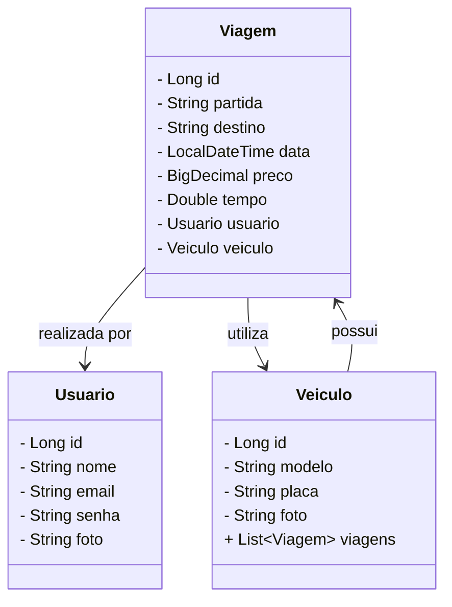
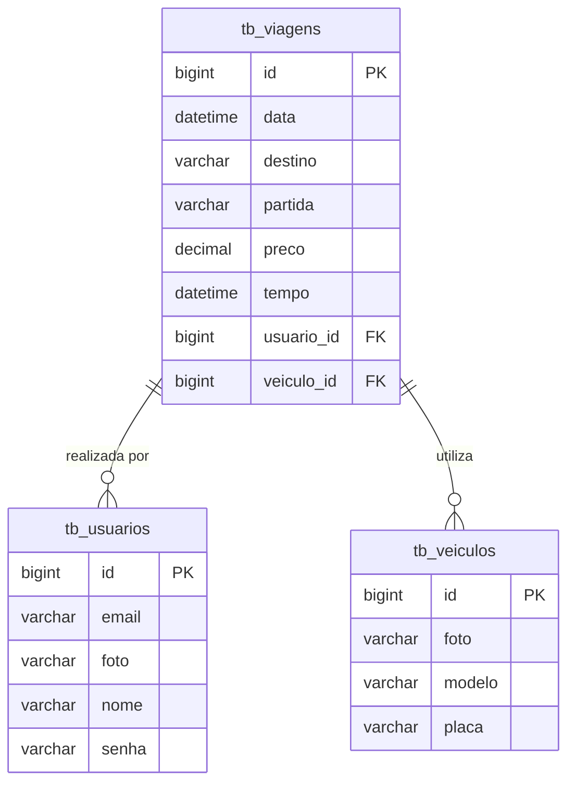

<div align="center"> <a href="https://git.io/typing-svg">  </a> </div>

<div align="center">
  
</a>
</div>

## 🧭 Visão de Negócio

O GoTogether nasceu da ideia de unir tecnologia, sustentabilidade e conexão entre pessoas em uma única plataforma. Nosso objetivo é oferecer uma solução moderna e acessível para conectar motoristas e passageiros com rotas semelhantes, promovendo praticidade, redução de custos e impacto ambiental positivo. A proposta é criar um aplicativo de caronas compartilhadas, incentivando o uso coletivo dos veículos e fortalecendo redes de confiança entre os usuários. A plataforma organiza e automatiza etapas como cadastro de viagens, associação de veículos, seleção de motoristas e passageiros, garantindo eficiência e segurança.


## 🛠️ Metodologia de Desenvolvimento
O desenvolvimento foi realizado de forma colaborativa e iterativa, priorizando aprendizado coletivo e clareza técnica. O grupo realizou brainstorms, abstração de requisitos e documentação contínua, garantindo alinhamento entre design, código e propósito.

- Pilares principais:

1. Simplicidade de uso
2. Sustentabilidade como propósito
3. Escalabilidade para futuras evoluções


## 🗂️ Documentação e Organização
A documentação foi elaborada com o Typora, utilizando arquivos Markdown para criar um README.md padronizado e legível. Essa escolha garante uma estrutura clara, ideal para apresentações e futuras manutenções.


## 🔄 Controle de Versão e Colaboração
- Versionamento realizado com Git
- Repositório hospedado no GitHub
- Uso de commits frequentes e revisões em grupo


## 🚀 Escopo da Primeira Versão
A primeira entrega do GoTogether foi focada em uma base sólida de backend, garantindo o funcionamento essencial de um sistema de caronas compartilhadas.

---

### ✅ Funcionalidades Implementadas
- CRUD completo das entidades Usuário, Veículo e Viagem
- Relacionamentos entre entidades com JPA
- Testes de endpoints via Insomnia
- Estrutura API RESTful com boas práticas
- Banco de dados relacional MySQL com JPA/Hibernate
- Deploy local via Maven e Tomcat embutido

## 📈 Resultados e Entrega
O grupo entregou um protótipo funcional de backend, validado com endpoints REST e integração ao banco de dados.

### Principais conquistas:
- Domínio de fundamentos em Java e Spring Boot
- Aplicação correta do padrão MVC e RESTful
- Organização técnica e documentação coerente
- Clareza entre propósito e impacto social

--- 

## 🧩 Diagrama de Classes



---

## 🗂️ 4. Diagrama Entidade-Relacionamento (DER)



---

## 🛠️ Tecnologias utilizadas

| Item                          | Descrição  |
| ----------------------------- | ---------- |
| **Servidor**                  | Tomcat embutido    |
| **Linguagem de programação**  | Java |
| **Framework**                 | Spring Boot    |
| **ORM**                       | JPA, Hibernate    |
| **Banco de dados Relacional** | MySQL      |
| **IDE** | Eclipse / STS      |
| **Testes de API** | Insomnia      |
| **Gerenciador de Dependências** | Maven      |
| **Versionamento** | Git + GitHub      |
| **Documentação** | Typora / SharePoint      |

---

## 🚗 Modelo de Entidade – Viagem

```bash
@Entity
@Table(name = "tb_viagens")
public class Viagem {

    @Id
    @GeneratedValue(strategy = GenerationType.IDENTITY)
    private Long id;

    private String partida;
    private String destino;
    private LocalDateTime data;
    private BigDecimal preco;
    private Double tempo;

    @ManyToOne
    private Usuario usuario;

    @ManyToOne
    private Veiculo veiculo;

    // Getters e Setters
}
```

---

## 🧪 Testes
- Foram realizados testes manuais via Insomnia e automatizados (JUnit) para validar:
- Inserção, atualização, consulta e exclusão de viagens, usuários e veículos
- Retornos corretos dos endpoints REST
- Persistência no banco de dados
- Respostas HTTP adequadas

---

## 🧱 Desafios e Soluções

| Desafios                          | Solução  |
| ----------------------------- | ---------- |
| **Mapeamento de relacionamentos**                  | Uso correto de anotações JPA como @ManyToOne    |
| **Configuração do banco**                  | Ajuste no application.properties e uso de spring.jpa.hibernate.ddl-auto    |
| **Padronização de endpoints**                  | 	Definição de convenções REST    |
| **Testes de API**                  | Uso do Insomnia e validações CRUD    |

---

## 🌎 Impactos e Benefícios
- Incentiva o uso consciente de veículos
- Reduz custos com transporte diário
- Diminui a emissão de poluentes
- Cria base para integração com funcionalidades futuras (pagamento, avaliação, chat)
- Demonstra o uso da tecnologia como agente de mobilidade sustentável

---

🙌 Equipe
Desenvolvido por Grupo A – [Tech Sisters](https://projeto-integrador-grupo-01.github.io/techsisters/) 🚘

<table align="center"> <tr> <td align="center"> <a href="https://github.com/nicollyjesus">  <br/><sub><b>Nicolly Jesus</b></sub> </a> </td> <td align="center"> <a href="https://github.com/crissmcoelho">  <br/><sub><b>Cristina Coelho</b></sub> </a> </td> <td align="center"> <a href="https://github.com/LemesdeMorais">  <br/><sub><b>Rafaela Lemes</b></sub> </a> </td> <td align="center"> <a href="https://github.com/queren-alves">  <br/><sub><b>Quéren Alves</b></sub> </a> </td> <td align="center"> <a href="https://github.com/alineromanini">  <br/><sub><b>Aline Romanini</b></sub> </a> </td> <td align="center"> <a href="https://github.com/cdouradom">  <br/><sub><b>Cintia Dourado</b></sub> </a> </td> </tr> </table>
